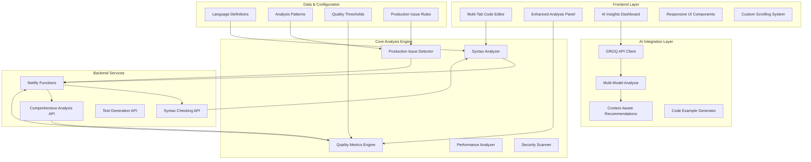
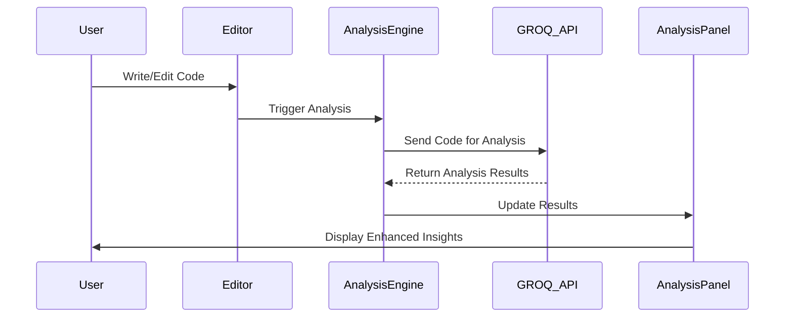
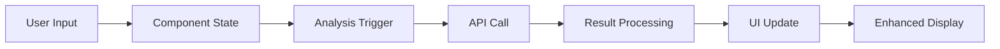

# Current System Architecture v2.0

## 🏗️ Enhanced System Architecture

The Code Quality Analysis Tool v2.0 follows a modern, component-based architecture with AI integration, enhanced UI/UX, and production-level analysis capabilities.

### High-Level Architecture Overview



## 🔧 Component Architecture

### Frontend Components Hierarchy

```
src/
├── components/
│   ├── ui/                     # Base UI components (shadcn/ui)
│   │   ├── card.tsx
│   │   ├── button.tsx
│   │   ├── tabs.tsx
│   │   └── ...
│   ├── EditorPanel.tsx         # Main editor container
│   ├── TabsCodeEditor.tsx      # Multi-file tab editor
│   ├── AnalysisPanel.tsx       # Analysis results container
│   ├── CodeAnalysisDisplay.tsx # Tabbed analysis interface
│   ├── EnhancedAIInsights.tsx  # AI-powered insights with filtering
│   ├── EnhancedComplexityDisplay.tsx # Advanced complexity analysis
│   ├── SyntaxErrorsDisplay.tsx # Syntax error visualization
│   └── ...
├── pages/
│   ├── Editor.tsx              # Main editor page
│   ├── Index.tsx               # Landing page
│   └── NotFound.tsx
├── utils/
│   ├── productionAnalysis.ts   # Production-level issue detection
│   ├── scrollUtils.ts          # Enhanced scrolling utilities
│   ├── editorScrollUtils.ts    # Editor-specific scroll handling
│   ├── codeAnalysis.ts         # Core analysis functions
│   ├── complexityAnalysis.ts   # Complexity calculation
│   ├── securityScanner.ts      # Security vulnerability detection
│   └── ...
└── types/
    ├── index.ts                # Core type definitions
    └── complexityTypes.ts      # Complexity analysis types
```

### Key Architectural Patterns

#### 1. Container-Presenter Pattern
- **Containers**: Handle state management and data flow
- **Presenters**: Pure UI components for rendering

#### 2. Composition over Inheritance
- UI components composed from smaller, reusable parts
- Flexible component architecture with props-based customization

#### 3. Separation of Concerns
- **UI Layer**: React components, styling, user interactions
- **Business Logic**: Analysis algorithms, data processing
- **Integration Layer**: API calls, external service communication

## 🔄 Data Flow Architecture

### Analysis Workflow



### State Management Flow



## 🎨 UI/UX Architecture

### Enhanced Scrolling System
- **Custom Scrollbars**: Styled scrollbars with opacity transitions
- **Overflow Handling**: Proper container-based scrolling
- **Responsive Design**: Adaptive scrolling for different screen sizes

### Multi-File Editor Architecture
- **Tab Management**: Dynamic file creation and management
- **Synchronized Scrolling**: Line numbers sync with code content
- **Keyboard Shortcuts**: Enhanced navigation and editing

### Analysis Panel Architecture
- **Tabbed Interface**: Organized analysis results
- **Filterable Content**: Issue filtering by type and severity
- **Expandable Sections**: Collapsible analysis categories

## ⚙️ Backend Architecture

### Netlify Functions Structure

```
netlify/functions/
├── groq-comprehensive-analysis.ts  # Main analysis endpoint
├── groq-syntax-checker.ts          # Syntax validation
├── groq-test-generator.ts          # Test case generation
├── groq-improvements.ts            # Improvement suggestions
└── groq-recommendation.ts          # AI recommendations
```

### API Integration Architecture

#### GROQ Integration
- **Multi-Model Support**: Different models for different analysis types
- **Error Handling**: Robust error handling and fallbacks
- **Rate Limiting**: Built-in request throttling
- **Context Management**: Maintains analysis context across requests

## 🔒 Security Architecture

### Frontend Security
- **Input Sanitization**: Code input validation and sanitization
- **XSS Prevention**: Proper content rendering and escaping
- **Content Security Policy**: Implemented via headers

### Backend Security
- **API Key Management**: Secure GROQ API key handling
- **Request Validation**: Input validation on all endpoints
- **Rate Limiting**: Protection against abuse

## 📊 Performance Architecture

### Frontend Optimization
- **Code Splitting**: Lazy loading of analysis components
- **Virtualization**: Efficient rendering of large analysis results
- **Memoization**: React.memo and useMemo for expensive operations
- **Debounced Analysis**: Prevents excessive API calls

### Backend Optimization
- **Caching**: Results caching where appropriate
- **Streaming**: Efficient data transfer
- **Connection Pooling**: Optimized API connections

## 🔧 Configuration Architecture

### Environment Configuration
```typescript
// Environment variables
const config = {
  groqApiKey: process.env.GROQ_API_KEY,
  groqApiUrl: process.env.GROQ_API_URL,
  analysisTimeout: process.env.ANALYSIS_TIMEOUT || 30000,
  maxCodeLength: process.env.MAX_CODE_LENGTH || 50000
};
```

### Analysis Configuration
```typescript
// Production issue detection rules
const PRODUCTION_ISSUE_TYPES = {
  'null-pointer': {
    severity: 'critical',
    category: 'reliability',
    impact: 'High - Can cause application crashes'
  },
  // ... more rules
};
```

## 🚀 Deployment Architecture

### Build Process
1. **TypeScript Compilation**: Type checking and compilation
2. **Vite Build**: Optimized production build
3. **Asset Optimization**: Minification and compression
4. **Function Deployment**: Netlify Functions deployment

### Hosting Architecture
- **Frontend**: Netlify static hosting with CDN
- **Functions**: Netlify Edge Functions for API endpoints
- **Assets**: CDN-delivered static assets

## 📈 Monitoring & Analytics

### Error Tracking
- **Frontend Errors**: Client-side error boundary handling
- **API Errors**: Structured error logging and reporting
- **User Feedback**: Built-in error reporting mechanisms

### Performance Monitoring
- **Analysis Performance**: Timing and performance metrics
- **UI Responsiveness**: Frontend performance tracking
- **API Response Times**: Backend performance monitoring

## 🔮 Future Architecture Considerations

### Planned Enhancements
1. **Database Integration**: User analysis history storage
2. **Real-time Collaboration**: Multi-user editing capabilities
3. **Plugin Architecture**: Extensible analysis plugins
4. **Advanced AI Models**: Integration with additional AI providers
5. **Enterprise Features**: Advanced reporting and team management

### Scalability Considerations
- **Microservices**: Breaking down functions into smaller services
- **Caching Layer**: Redis or similar for analysis result caching
- **Load Balancing**: Distribution of analysis workload
- **Database Optimization**: Efficient data storage and retrieval

This architecture provides a solid foundation for continued development and enhancement while maintaining code quality, performance, and user experience standards.