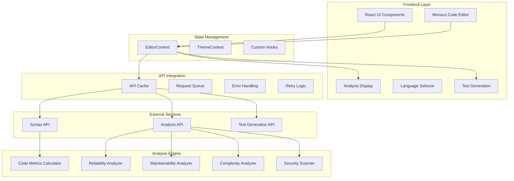
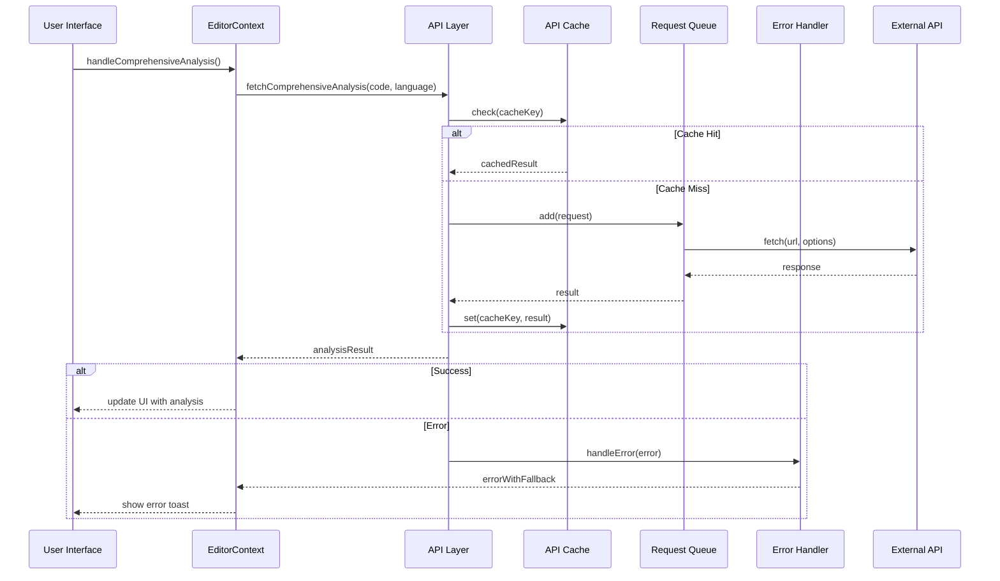
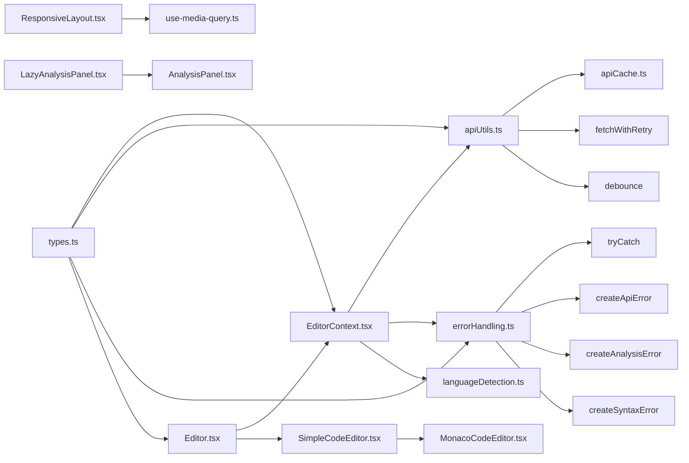

# Architecture & Design

## 🏗️ System Architecture

The Code Quality Tool follows a modular, layered architecture designed for maintainability, extensibility, and clear separation of concerns.

### High-Level Architecture Diagram



## 📁 Folder Structure

```
src/
├── components/              # React UI Components
│   ├── ui/                 # Shadcn UI Components
│   ├── MonacoCodeEditor.tsx # Monaco editor integration
│   ├── SimpleCodeEditor.tsx # Higher-level editor wrapper
│   ├── AnalysisPanel.tsx   # Results display
│   ├── CodeAnalysisDisplay.tsx # Analysis visualization
│   ├── ResponsiveLayout.tsx # Responsive design component
│   ├── KeyboardShortcutsHelp.tsx # Keyboard shortcuts help
│   ├── LazyAnalysisPanel.tsx # Lazy-loaded analysis panel
│   └── ...                 # Other UI components
├── context/                # React Context Providers
│   └── EditorContext.tsx  # Editor state management
├── utils/                  # Core Business Logic
│   ├── apiCache.ts        # API caching system
│   ├── apiUtils.ts        # API utilities (queue, retry, debounce)
│   ├── errorHandling.ts   # Error handling utilities
│   ├── languageDetection.ts # Language detection
│   ├── codeMetrics.ts     # Core metrics calculation
│   ├── codeAnalysis.ts    # Analysis orchestration
│   ├── securityScanner.ts # Security analysis
│   └── syntaxAnalyzer.ts  # Syntax checking
├── hooks/                  # React Custom Hooks
│   ├── use-media-query.ts # Responsive design hook
│   └── use-toast.ts       # Toast notification hook
├── data/                  # Static Data
│   └── languages.ts       # Supported language definitions
├── types/                 # Type Definitions
│   └── index.ts          # Global TypeScript types
├── pages/                 # Page Components
│   ├── Editor.tsx        # Main editor page
│   ├── EditorWithContext.tsx # Context-based editor
│   └── api/              # API route handlers
└── lib/                  # Utility Libraries
```

## 🔄 Component Interactions

### Analysis Flow Architecture



### Data Flow Patterns

#### 1. Input Processing
```
User Code → Language Auto-Detection → Syntax Validation → API Request Preparation
```

#### 2. API Request Flow
```
Request → Cache Check → Queue Management → Rate Limit Handling → Retry Logic → Response Processing
```

#### 3. Analysis Pipeline
```
API Response → Error Handling → State Update → UI Rendering → User Feedback
```

#### 4. Test Generation Flow
```
Code Analysis → Test Case Generation → Test Execution → Result Visualization
```

## 🧩 Module Relationships

### Core Dependencies



### Interface Contracts

#### Editor Context Interface
```typescript
interface EditorContextType {
  // Code state
  code: string;
  setCode: (code: string) => void;
  
  // Language state
  selectedLanguage: ProgrammingLanguage;
  setSelectedLanguage: (language: ProgrammingLanguage) => void;
  
  // Analysis state
  analysis: CodeAnalysis | null;
  isAnalyzing: boolean;
  handleComprehensiveAnalysis: () => Promise<void>;
  
  // Syntax state
  syntaxErrors: SyntaxError[];
  checkCodeSyntax: () => Promise<void>;
  
  // UI state
  handleReset: () => void;
}
```

#### API Cache Interface
```typescript
interface CacheItem<T> {
  data: T;
  timestamp: number;
  ttl: number;
}

interface ApiCache {
  get<T>(key: string): T | null;
  set<T>(key: string, data: T, ttl?: number): void;
  has(key: string): boolean;
  delete(key: string): void;
  clear(): void;
}
```

#### Error Handling Interface
```typescript
interface ErrorOptions {
  retry?: () => Promise<any>;
  language?: string;
  code?: string;
  context?: Record<string, any>;
}

interface ApiError extends Error {
  type: 'api' | 'syntax' | 'analysis' | 'validation' | 'network';
  retry?: () => Promise<any>;
  context?: Record<string, any>;
}
```

## 🔧 Design Patterns

### 1. Context Provider Pattern
Centralized state management with React Context:
```typescript
export const EditorProvider: React.FC<EditorProviderProps> = ({ children }) => {
  // State
  const [code, setCode] = useState<string>('');
  const [selectedLanguage, setSelectedLanguage] = useState<ProgrammingLanguage>(programmingLanguages[0]);
  const [analysis, setAnalysis] = useState<CodeAnalysis | null>(null);
  
  // Context value
  const value: EditorContextType = {
    code,
    setCode,
    selectedLanguage,
    setSelectedLanguage,
    analysis,
    isAnalyzing,
    handleComprehensiveAnalysis,
    syntaxErrors,
    checkCodeSyntax,
    handleReset
  };
  
  return (
    <EditorContext.Provider value={value}>
      {children}
    </EditorContext.Provider>
  );
};
```

### 2. Queue Pattern
Managing API requests to prevent rate limiting:
```typescript
class RequestQueue {
  private queue: Array<() => Promise<unknown>> = [];
  private isProcessing = false;
  private concurrentLimit = 2;
  private activeRequests = 0;
  
  async add<T>(requestFn: () => Promise<T>): Promise<T> {
    return new Promise<T>((resolve, reject) => {
      const executeRequest = async () => {
        try {
          this.activeRequests++;
          const result = await requestFn();
          resolve(result);
          return result;
        } catch (error) {
          reject(error);
          throw error;
        } finally {
          this.activeRequests--;
          this.processNext();
        }
      };
      
      this.queue.push(executeRequest);
      
      if (!this.isProcessing) {
        this.processNext();
      }
    });
  }
  
  // Process next request in queue
  private async processNext(): Promise<void> {
    // Implementation details...
  }
}
```

### 3. Cache Pattern
Efficient caching of API responses:
```typescript
export const apiCache = {
  get<T>(key: string): T | null {
    const item = localStorage.getItem(`cache_${key}`);
    if (!item) return null;
    
    const { data, timestamp, ttl } = JSON.parse(item) as CacheItem<T>;
    const now = Date.now();
    
    if (now - timestamp > ttl) {
      this.delete(key);
      return null;
    }
    
    return data;
  },
  
  set<T>(key: string, data: T, ttl: number = DEFAULT_TTL): void {
    const cacheItem: CacheItem<T> = {
      data,
      timestamp: Date.now(),
      ttl
    };
    
    localStorage.setItem(`cache_${key}`, JSON.stringify(cacheItem));
  },
  
  // Additional methods...
};
```

### 4. Error Handling Pattern
Consistent error handling with typed errors:
```typescript
export async function tryCatch<T, F = null>(
  fn: () => Promise<T>,
  fallback: F,
  options: ErrorOptions = {}
): Promise<T | F> {
  try {
    return await fn();
  } catch (error) {
    console.error('Operation failed:', error);
    
    // Handle the error with toast notification
    handleError(error, options);
    
    // Return fallback value
    return fallback;
  }
}
```

## 🏢 Architectural Principles

### 1. Separation of Concerns
- **UI Layer**: React components handle presentation only
- **State Management**: Context providers manage application state
- **API Integration**: Utilities handle API communication
- **Business Logic**: Utility functions handle analysis and computation

### 2. Single Responsibility
Each module has a focused responsibility:
- `EditorContext.tsx`: Manages editor state and operations
- `apiUtils.ts`: Handles API request management
- `errorHandling.ts`: Centralizes error handling
- `MonacoCodeEditor.tsx`: Handles code editing functionality

### 3. Open/Closed Principle
- Easy to add new languages without modifying existing code
- New analysis features can be added through API integration
- Extensible component system with composition

### 4. Dependency Inversion
- High-level modules depend on abstractions, not implementations
- Context providers abstract state management
- Interface-based design for better testability
- Custom hooks abstract complex logic

## 🔄 Configuration Architecture

### API Configuration
```typescript
// API request configuration
export const API_CONFIG = {
  baseUrl: '/api',
  endpoints: {
    syntaxCheck: '/syntaxCheckerAPI',
    analysis: '/groqComprehensiveAnalysisAPI',
    testGeneration: '/groqTestAPI'
  },
  defaultHeaders: {
    'Content-Type': 'application/json'
  },
  timeout: 30000,
  retries: 3,
  cacheTime: 5 * 60 * 1000 // 5 minutes
};
```

### Language Configuration
```typescript
// Language configuration
export const programmingLanguages: ProgrammingLanguage[] = [
  {
    id: 'javascript',
    name: 'JavaScript',
    monacoId: 'javascript',
    extension: 'js',
    patterns: {
      comments: ['//', '/*'],
      functions: ['function', '=>'],
      classes: ['class'],
      loops: ['for', 'while', 'do'],
      conditionals: ['if', 'switch', 'ternary']
    }
  },
  // Additional languages...
];
```

### Error Handling Configuration
```typescript
// Error handling configuration
export const ERROR_CONFIG = {
  defaultMessages: {
    api: 'An error occurred while communicating with the server',
    syntax: 'Syntax check failed',
    analysis: 'Analysis failed',
    validation: 'Invalid input',
    network: 'Network error'
  },
  retryDelays: [1000, 2000, 4000], // Exponential backoff
  maxRetries: 3
};
```

## 🎯 Performance Optimizations

### Code Splitting
- **Lazy Loading**: Heavy components loaded only when needed
- **Dynamic Imports**: Reduces initial bundle size
- **Suspense Boundaries**: Provides loading states during component loading

```typescript
// Lazy loading example
const LazyAnalysisPanel = lazy(() => import("@/components/LazyAnalysisPanel"));

// Usage with Suspense
<Suspense fallback={<AnalysisLoading />}>
  <LazyAnalysisPanel analysis={analysis} language={selectedLanguage.id} />
</Suspense>
```

### Render Optimization
- **Memoization**: Prevents unnecessary re-renders
- **useCallback/useMemo**: Prevents recreation of functions and values
- **Optimized Dependencies**: Careful management of effect dependencies

```typescript
// Memoized callback example
const handleComprehensiveAnalysis = useCallback(async () => {
  // Implementation details...
}, [code, selectedLanguage.id, toast]);
```

### Network Optimization
- **Caching**: Prevents redundant API calls
- **Request Queue**: Controls request frequency
- **Debouncing**: Prevents excessive requests during rapid user input

## 🔒 Error Handling Architecture

### Typed Errors
```typescript
// Creating typed errors
export function createApiError(
  message: string,
  options: ErrorOptions = {}
): ApiError {
  const error = new Error(message) as ApiError;
  error.type = 'api';
  error.retry = options.retry;
  error.context = options.context;
  return error;
}
```

### Error Boundaries
- UI components wrapped with error boundaries
- Analysis failures don't crash the entire application
- Meaningful error messages for users

### Graceful Degradation
```typescript
// Try-catch with fallback pattern
export async function tryCatch<T, F = null>(
  fn: () => Promise<T>,
  fallback: F,
  options: ErrorOptions = {}
): Promise<T | F> {
  try {
    return await fn();
  } catch (error) {
    handleError(error, options);
    return fallback;
  }
}
```

### Toast Notifications
- User-friendly error messages
- Action buttons for retry functionality
- Consistent error presentation

## 🌐 Responsive Design Architecture

### Media Query Hook
```typescript
export function useMediaQuery(query: string): boolean {
  const [matches, setMatches] = useState<boolean>(false);
  const [mounted, setMounted] = useState<boolean>(false);

  useEffect(() => {
    setMounted(true);
    const mediaQuery = window.matchMedia(query);
    setMatches(mediaQuery.matches);

    const handleChange = (event: MediaQueryListEvent) => {
      setMatches(event.matches);
    };

    mediaQuery.addEventListener('change', handleChange);
    return () => mediaQuery.removeEventListener('change', handleChange);
  }, [query]);

  return mounted ? matches : false;
}
```

### Responsive Layout Component
- Adapts layout based on screen size
- Provides different views for mobile and desktop
- Maintains consistent user experience across devices

### Mobile-First Approach
- Designed for mobile first, then enhanced for desktop
- Adaptive controls for different screen sizes
- Touch-friendly interface elements

This architecture ensures maintainability, extensibility, and robustness while providing clear separation of concerns and enabling future enhancements.
